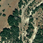
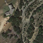
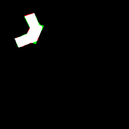
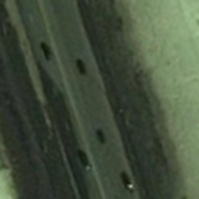
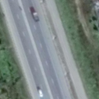

# GeSANet
Code for paper 'GeSANet: Geospatial-Awareness Network for VHR Remote Sensing Image Change Detection'

## Dataset Preparation
> LEVIR: 256*256

> CDD  : 256*256

## Train
1. Use following command for training

    ```python train.py --dataset (dataset_name) --datadir (dataset_path) ```
2. The trained models will be saved at ./checkpoint/GeSANet/(dataset_name) path.

## Test

1. According to the trained models, use following command for testing

    ```python test.py --dataset (dataset_name) --datadir (dataset_path) ```

2. The predictions will be saved at ./result/GeSANet/(dataset_name) path.

3. If you need some of the predictions, please contact me.

|    |  T1 | T2 | GT | Pred| Diff |
| ----  | ---- | ---- | ---- | ---- |---- |
|LEVIR|      |      |  |   | |
|CDD|      |      |  |   | |

## Acknowledgements
Thank related open source projects for supporting this repository.


