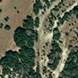
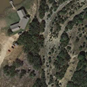
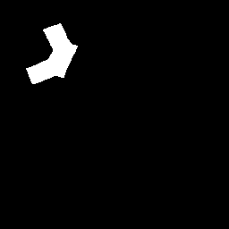
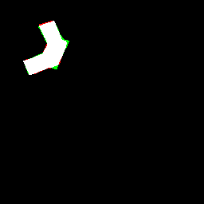
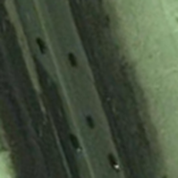
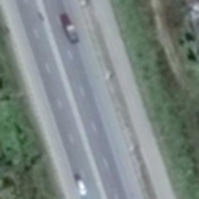

# GeSANet

Code for paper 'GeSANet: Geospatial-Awareness Network for VHR Remote Sensing Image Change Detection'

> Abstract—The characteristics of very high resolution (VHR) remote sensing images (RSIs) have a higher spatial resolution inherently, and are easier to obtain globally compared with hy-perspectral images (HSIs), which makes it possible to detect small-scale land cover changes in multi-field applications. RSI change detection (RSI-CD) based on deep learning has been paid attention to and become a frontier research field in recent years, and is currently facing two challenging problems: The first is high dependence on registration between bi-temporal images caused by high spatial resolution; The other is high pseudo-change information response during the process of change detec-tion caused by low spectral resolution. To address the above-mentioned two problems, a novel RSI-CD framework called Geospatial-Awareness Network (GeSANet) based on the geospa-tial Position Matching Mechanism (PMM) with multi-level ad-justment and the geospatial Content Reasoning Mechanism (CRM) with diverse pseudo-change information filtering is pro-posed in this paper. First of all, the PMM assigns independent two-dimensional offset coordinates to each position in the previ-ous temporal image, afterwards, bilinear interpolation is em-ployed to obtain the subpixel feature value after the offset, and the sparse results based on the difference are transmitted to the next level prediction to realize multi-level geospatial correction. The CRM extracts global features from the corrected sparse feature map in terms of dimensions, implementing effective dis-criminant feature extraction on basis of the original feature map in a stepwise refinement manner through the cross-dimension exchange mechanism, to filter out various pseudo-change infor-mation as well as maintain real change information. Comparison experiments with five recent SOTA methods are carried out on two popular datasets with diverse changes, the results show that the proposed method has good robustness and validity for multi-temporal RSI-CD. In particular, it has a strong comparative advantage in detecting small entity changes and edge details.

## Dataset Preparation

> LEVIR: 256*256

> CDD  : 256*256

## Test

1. Download the trained models

| model name              | dataset     | link |
| ----------              | -------     | ---- |
| cdd.pth    | CDD      | link：https://pan.baidu.com/s/1bQZH30n_yTsopRD_VN-Hdg?pwd=cr2z code：cr2z |
| levir.pth| LEVIR | link：https://pan.baidu.com/s/1bQZH30n_yTsopRD_VN-Hdg?pwd=cr2z code：cr2z |

2. Use following command for testing

> --dataset (dataset_name) --datadir (test-dataset_path) --checkpointdir (checkpoint_path) --resultdir (save_path) --encoder-arch resnet18 --store-imgs

>The code is coming soon.

3. Testing results

|    |  T1 | T2 | GT | Pred| Diff |
| ----  | ---- | ---- | ---- | ---- |---- |
|LEVIR|      |      |  |   | |
|CDD|      |      |  |   | |

